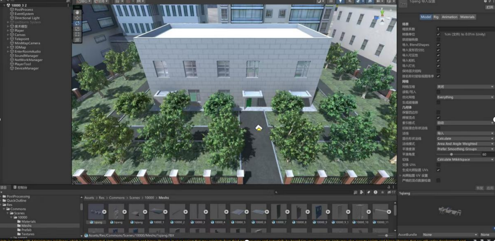
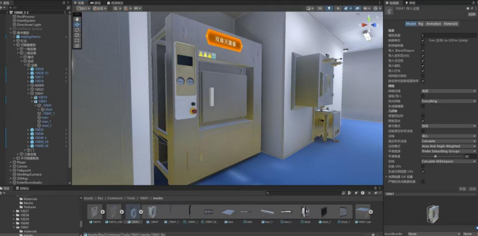
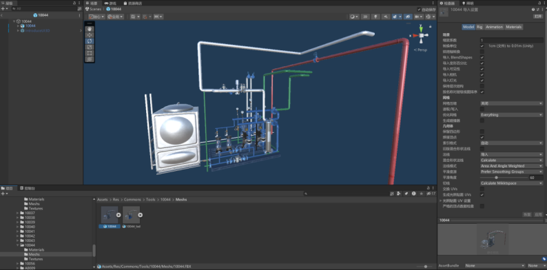
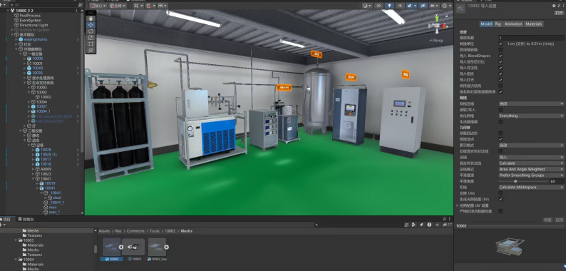

高等级生物安全实验室数字孪生系统
详细设计说明书
一、项目概述
本系统旨在构建与现实 P4 级别生物安全实验室 1:1 还原的数字孪生平台，通过高清 3D 建模、XR 交互，实现实验室虚拟漫游、设备操作培训、安全监控、数据管理等核心功能。适配 VR 设备（PICO 4 Ultra）和电脑，为实验室规划、培训、运维提供沉浸式、可视化解决方案。
二、设计范围
覆盖系统核心模块的技术设计，包括 3D 模型构建、VR 客户端交互（消息接收与响应）、PC 客户端交互（消息接收与响应）、AI 的对话设计等，重点聚焦 3D 模型构建设计逻辑、VR 客户端交互（消息接收与响应）及 PC 客户端交互（消息接收与响应）。
三、核心目标
VR 客户端（适配 PICO 4 Ultra）：实现实验室 1:1 沉浸式漫游，支持设备操作、信息查询、培训教学；
PC 客户端：提供桌面级 3D 场景浏览、设备状态监控、数据可视化，支持键鼠精准操作，兼顾画面质量与运行流畅性；
覆盖实验室 3 层建筑、12 种实验设备、8 种运维设备的精准 3D 呈现，支持数据互通与操作协同。
四、系统总体架构设计 1.系统层次架构
系统采用分层架构设计，包含表现层、应用层、数据层三个主要层次：
表现层：
VR 客户端：基于 Unity 开发的沉浸式虚拟现实体验
PC 客户端：基于 Unity 开发的桌面端应用
应用层：
场景管理引擎：负责 3D 场景的加载、卸载和状态管理
交互逻辑控制器：处理用户输入和设备交互
数据同步服务：实现多端数据一致性
消息分发系统：协调系统内部通信
数据层：
3D 模型资产库：存储所有建筑和设备模型
设备运行数据库：记录设备状态和历史数据
知识图谱系统：存储生物安全相关知识
多媒体资源库：存储视频、音频、文档等资料
2.3D 模型构建设计
以 “1:1 还原现实” 为核心，基于二维施工图纸、哈兽研实景照片 / 视频，确保模型比例、尺寸、结构与物理空间完全一致，同时兼顾渲染性能与交互流畅性。
（1）建筑模型构建
数据输入与预处理：解析实验室 3 层建筑施工图纸，提取楼层布局、墙体厚度、门窗位置等关键参数；对实景照片 / 视频进行纹理采集、畸变校正，生成可复用纹理素材。
分层次建模流程：先完成整体结构建模（外形、楼层框架、通道走向），再进行内部空间细节建模（更衣区、核心实验区等功能区域），最后添加基础设施（试验台、通风管道等）。
精度控制要点：核心区域（如核心实验区换衣间、消毒间）空间尺寸误差 ≤±5cm；通道走向与现实一致，确保虚拟漫游路径匹配实际人员 / 物资流动逻辑。
材质与光照处理：墙体采用真实涂层材质、地面用防滑地砖纹理，通过纹理绘制软件将实拍纹理映射至模型；室内光照模拟普通照明效果，结合烘焙光照提升静态场景真实感，动态区域（如旋转风扇）采用实时光照。

（2）实验设备建模
设备参数采集：获取 12 种实验设备（生物安全柜、正压服等）的实际尺寸、外观结构、材质说明。
精细化建模重点：关键部件（生物安全柜的操作窗口、风机系统；设备控制面板的按钮、显示屏）需单独建模，确保运动状态可精准展示；流体、光粒子等特效复用同类资源（如废水处理的 “干净 - 变脏” 粒子效果）。
材质适配规则：不锈钢材质设备模拟金属光泽，橡胶材质设备（正压服）呈现柔软质感，确保视觉效果与实际设备一致。

（3）运维设备建模
结构拆分建模：对 8 种运维设备按功能拆分组件（如空气净化设备拆分为过滤器、风机、管道；UPS 拆分为柜体、电池组、控制面板），组件间连接关系与现实一致。
功能可视化设计：空气净化设备通过半透明滤网材质 + 粒子特效展示过滤效果；污水处理设备采用耐腐蚀材质，呈现处理池、水泵等核心结构；环境监测设备的显示屏模型预留数据接口，支持实时数据对接。

（4）模型集成与优化
所有模型通过 Unity 引擎部署整合，添加物理碰撞属性（如墙体碰撞、设备可交互区域标记）。
采用模型轻量化技术（简化非关键面、复用通用模型），确保 VR 端运行帧率稳定。

3.VR 端消息接收与响应逻辑
（1）消息接收类型及来源
硬件输入消息：来自 PICO 4 Ultra 设备，包括手柄操作（按键、遥杆、点击）、头部追踪数据、身体移动追踪数据、语音指令。
接口数据消息：来自生物安全知识图谱 API、设备多媒体资源 API（讲解视频、文字、语音）、设备状态数据接口（运行 / 停止、温度、压力等参数）。
系统控制消息：来自系统后台的场景切换指令、权限验证结果、异常告警触发信号。
（2）消息处理流程
消息捕获：实时监听硬件设备输入端口和 API 数据推送通道，确保无延迟捕获各类消息。
消息解析：对捕获的消息进行格式转换和语义识别，例如将手柄遥杆数据解析为移动指令、将语音指令转换为信息查询请求。
权限校验：针对涉及设备操作、敏感数据查看的消息，校验当前用户权限是否符合访问要求。
指令分发：将解析后的有效消息分发至对应功能模块（导航模块、信息展示模块、设备监控模块等）。
（3）核心响应逻辑
① 导航与移动响应：
接收手柄遥杆 / 身体追踪移动消息：触发虚拟场景中用户视角的实时平移，同步更新场景画面，确保移动流畅无卡顿。
接收手柄点击瞬移消息：根据点击位置坐标，瞬间切换用户视角至目标区域，同时触发场景过渡动画。
接收头部追踪消息：实时调整场景渲染角度，实现 360 度全方位视角切换，响应延迟 ≤10ms。
② 信息交互响应：
接收手柄靠近设备 / 区域的触发消息：调用设备多媒体 API，弹出简洁直观的信息面板，同步加载设备名称、型号、操作说明等文字信息。
接收语音 / 手柄 “播放” 指令消息：启动语音讲解播放，或弹出视频播放窗口，展示设备讲解内容，确保信息面板不遮挡核心场景。
接收知识查询相关消息：调用生物安全知识图谱 API，推送病毒类型、防护措施等知识提示，以悬浮文本形式展示。
③ 设备监控响应：
接收设备状态数据消息：实时更新虚拟设备的运行状态标识，温度、压力等参数以可视化图标展示。
接收设备异常告警消息：以醒目的颜色闪烁和专属提示音响应，同步弹出异常说明面板，标注异常参数及处理建议。
4.PC 端消息接收与响应逻辑
（1）消息接收类型及来源
用户输入消息：来自键盘（WASD 按键、Z 键）、鼠标（点击、长按、滑动）、界面按钮 / 滑动条操作。
数据接口消息：来自设备状态监控接口（实时运行数据、异常信号）、知识图谱 API、设备多媒体资源 API、外部环境 API（天气预报数据）。
系统配置消息：来自后台的楼层切换指令、视角模式配置、五要素数据更新信号。
（2）消息处理流程
输入捕获：通过系统输入监听模块，同步捕获键盘、鼠标及界面操作消息，确保操作指令无丢失。
数据解析：将设备状态数据、环境数据转换为系统可识别的标准化格式，将用户操作指令映射为对应功能代码。
场景匹配：根据用户输入的导航指令，匹配二维地图中的区域 / 设备坐标与 3D 场景的对应关系。
资源调度：针对多媒体资源请求，调度服务器端对应文件，优先加载缓存资源以提升响应速度。
（3）核心响应逻辑
① 导航与漫游响应：
接收二维地图点击消息：快速切换 3D 场景视角至目标区域 / 设备，同步高亮显示当前位置标识。
接收键盘 WASD 消息：触发场景中视角的平移漫游，移动速度可根据用户操作力度自适应调整。
接收瞬移指令消息（鼠标点击 / 界面按钮）：瞬间跳转至指定位置，无过渡动画以提升操作效率。
② 视角控制响应：
接收键盘 Z 键 / 界面视角按钮消息：切换至特写视角，聚焦目标设备细节，支持鼠标拖拽调整镜头角度。
接收滑动条操作消息：平滑切换全景视角与特写视角，确保画面过渡自然无撕裂。
③ 数据展示响应：
接收设备状态数据消息：在 Web 大屏以可视化图表展示运行 / 停止状态、温度、压力等参数，异常状态以红色图标突出提示。
接收五要素更新消息：同步刷新数字大屏的人员、设备、环境等数据展示，确保数据实时同步。
接收外部环境 API 消息：在场景中加载当日天气特效，同步显示环境参数数据。
④ 信息交互响应：
接收设备点击消息：调用多媒体 API，弹出设备信息面板，展示操作说明、维护记录及讲解视频 / 语音播放入口。
接收知识查看指令：推送生物安全法规、实验操作规程等知识内容，以半透明 UI 悬浮展示，不遮挡核心场景。
5.AI 对话设计
（1）功能定位
AI 对话系统作为系统的智能辅助核心，具备以下能力：
实时答疑：回答用户关于实验室设备、操作规程、安全规范、异常处理等问题；
语音与文本双模态输入：支持 VR 端语音输入与 PC 端文本输入。
（2）知识来源与结构
知识图谱系统：集成生物安全法规、设备操作手册、应急预案、历史故障库等结构化知识；
实时数据接口：接入环境传感器数据（气压、温湿度）、设备状态数据；
多媒体资源库：关联讲解视频、操作演示动画、故障处理录像；
外部知识库：支持接入国家标准、行业指南等权威资料。
（3）对话流程设计
① 用户发起提问
VR 端：用户通过语音提问（如“更衣间气压异常怎么办？”）；
PC 端：用户通过输入框输入问题；
系统识别意图：通过 NLU 模块解析问题类型（如“设备异常”、“知识查询”、“操作指导”）。
② 语义理解与知识检索
场景上下文感知：结合用户所在虚拟位置（如“核心工作间”）、当前环境数据（如气压值）增强理解；
知识匹配：从知识图谱中检索最相关的条目，如：标准参数范围；异常处理步骤；关联法规或规范；推荐学习资源（视频、文档）。
③ 响应生成与展示
结构化回复：如参考图片所示，回复内容包括：参数说明（如“更衣间应维持-15Pa 至-20Pa”）；处理步骤（分条列出）；关联资源（如“查看异常处理视频”）；

（4）界面与交互设计
输入区：PC 端：底部输入框，支持键盘输入；VR 端：语音按钮，点击后开始录音。

五、接口设计
（1）内部接口
内部接口用于系统各模块间的实时通信与数据交互，遵循统一的接口规范，确保模块解耦且协同高效，核心接口设计如下：
① 模块间通信接口
场景管理引擎与交互逻辑控制器接口：支持传递场景切换指令（如楼层跳转、设备特写切换）、用户操作坐标数据，返回场景加载状态（成功 / 失败 / 加载进度），采用同步调用方式。
交互逻辑控制器与数据同步服务接口：推送用户操作记录（如设备查询、漫游路径）、设备交互状态变更，接收多端数据同步结果，采用 TCP 协议传输，确保数据一致性。
消息分发系统与各功能模块接口：接收模块注册请求，分发系统控制消息（如异常告警、权限验证结果），支持广播（如全局告警）和单播（如指定模块配置更新）两种模式。
② 数据访问接口
应用层与数据层资源访问接口：提供 3D 模型、多媒体资源、知识数据的查询与调用能力，参数含资源 ID、类型（如 “实验设备 - 生物安全柜”“视频 - 操作讲解”），返回资源路径、格式标识、数据大小，采用缓存优先策略提升响应速度。
数据同步服务与设备运行数据库接口：支持设备状态数据（运行参数、异常信号）的实时写入与查询，采用增量同步机制，仅传输变更数据，降低带宽占用。
（2）外部接口
外部接口用于对接系统外第三方服务、硬件设备，接口设计遵循标准化协议，确保兼容性与数据安全性：
① 第三方服务接口
生物安全知识图谱 API 接口：采用 RESTful 协议，请求参数含查询关键词（如 “病毒类型 - 埃博拉”“防护措施 - 正压服穿戴”）、数据格式要求（JSON/XML），返回结构化知识数据（含定义、操作规范、关联法规），支持 HTTPS 加密传输。
设备多媒体资源 API 接口：支持按设备 ID、资源类型（视频 / 语音 / 文字）发起请求，返回资源下载链接、播放时长、文件大小，支持断点续传，适配 VR 端低延迟播放需求。
设备状态数据接口：采用 TCP 长连接方式，实时接收设备运行参数（温度、压力、运行状态）、异常告警信号，数据格式为 JSON，字段含设备 ID、参数名称、数值、采集时间戳。
外部环境（天气预报）API 接口：按日调用第三方气象服务，请求参数为实验室所在地区编码，返回当日天气类型、气温、降水概率等数据，用于场景特效渲染，调用失败时启用本地缓存数据。
② 硬件对接接口
PICO 4 Ultra 设备接口：基于 XR SDK 开发，支持手柄操作数据（按键、遥杆、点击事件）、头部追踪数据（角度、位置）、身体移动追踪数据的实时捕获。
六、非功能性设计
非功能性设计围绕系统稳定运行、用户体验优化、长期可扩展等目标，结合 VR/PC 双端特性制定，核心要求如下：
（1）性能设计
VR 端性能：适配 PICO 4 Ultra 设备，场景运行帧率稳定，模型加载时间 ≤3 秒（单楼层场景）、≤8 秒（全场景），交互响应延迟低，无卡顿、画面撕裂现象；支持 12 种实验设备、8 种运维设备同时加载无性能衰减。
PC 端性能：支持主流配置 PC（CPU i5 及以上、显卡 GTX 1660 及以上），全景视角渲染帧率 ≥60fps，设备特写视角帧率 ≥30fps，二维地图导航切换响应低。
（2）可靠性设计
数据可靠性：设备运行数据采用 “本地缓存 + 云端备份” 双存储机制，缓存数据保留最近 72 小时，云端数据实时同步，防止数据丢失；数据传输采用 CRC 校验，确保数据完整性，校验失败自动重传。
系统稳定性：支持 7×24 小时连续运行，无内存泄漏；场景加载失败时自动回退至最近可用场景，设备连接中断后 3 秒内发起重连，重连失败给出明确提示；异常告警功能误报率 ≤0.5%。
（3）兼容性设计
硬件兼容性：VR 端严格适配 PICO 4 Ultra 设备，支持手柄按键自定义映射；PC 端兼容 Windows 10/11 操作系统，支持分辨率自适应（1920×1080 至 4K），适配键鼠、触控板等输入设备。
软件兼容性：支持 Unity 2022 及以上版本开发的插件集成；多媒体资源支持主流格式解码，无额外插件依赖。
（4）可扩展性设计
功能扩展：接口采用模块化设计，支持新增实验设备类型（如后续添加新型检测设备）、功能模块，无需重构现有架构；数据层支持新增数据字段，兼容历史数据格式。
（5）易用性设计
交互易用性：VR 端操作符合 PICO 设备用户习惯，遥杆 / 头部追踪响应自然，语音指令识别准确率 ≥95%；PC 端支持键鼠快捷键（如 WASD 漫游、Z 键特写）与界面按钮双重操作，交互逻辑一致无冲突。
界面易用性：信息面板布局简洁，关键数据（如设备异常参数）突出显示，文字字号适配 VR 头盔与 PC 屏幕视觉体验；导航地图支持缩放、拖拽，当前位置标识清晰，区域划分直观。
学习成本：操作引导采用 “新手教程 + 实时提示” 模式，VR 端首次使用弹出分步操作指引，PC 端提供快捷键提示悬浮窗，用户无需专业培训即可快速上手。
