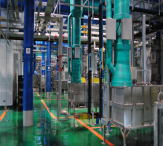
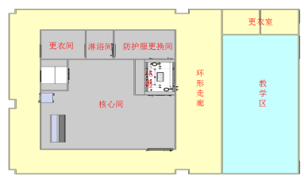
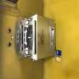
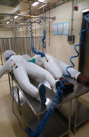
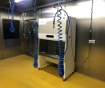
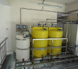
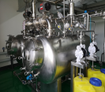

实验室及配套辅助设施，可开展各类实验动物的高致病性病原微生物感染研究
实验室总建筑面积 17669.8m2，生物安全实验楼 14062m2，局部六层结构，地下局部两层，地上局部四层。
实四个配套单体：热交换站 443m2；变电所 598m2；动力站 948m2；污水处理站 1290m2。仪器设备 1200 台（套），总投资 38157 万元。

实验室自 2018 年通过认可后，先后进行了非洲猪瘟病毒（ASFV）、牛结节性皮肤 病病毒（LSDV）及新型冠状肺炎病毒（SARS-CoV-2）生物学特性研究、动物模型构 建、疫苗评价、诊断检测技术开发等实质性工作。

研发了国家统一监管的高等级病原微生物实验室的网络协同系统，构建了安全可靠的网络协同体系架构
制定了网络协同数据及接口的标准规范，制定了系统安全防护体系。

研发了开发了 2 套计算机模拟培训和测评软件，2 个生物安全知识在线培训考核网站，编写了 2 套高等级病原微生物实验室生物安全培训教程，使用和操作影像教学片，建立相应培训及测评体系，将理论培训、计算机模拟培训与实际操作培训、教学影像片教学等方式相结合。
形成了一套系统规范的高等级生物安全培训教学及考评体系，建立了具有我国自主知识产权的高等级病原微生物实验室培训基地及培训体系。

每年完成国家重点研发计划百余名项目人员的相关培训及应用示范。
2021 年 5 月，西湖大学相关人员在国产化高等级病原微生物模式实验室进行生物安全培训。2023 年 7 月，珠海疾控中心相关人员在国产化高模式实验室进行生物安全培训。
2020 至 2023 年，每年在国产化高等级病原微生物模式实验室对中国农业科学院硕士、博士研究生进行生物安全课程培训。累计培训人数近 600 余人次，参观调研人数近 1000 余人。
